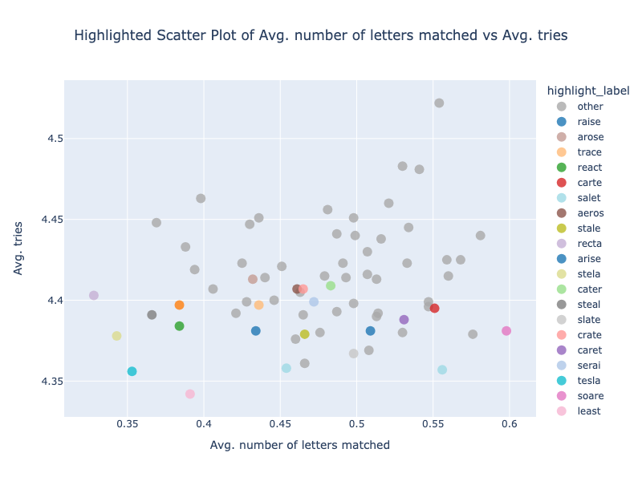

# projectwordle

Can we solve Wordle with simple heuristics?

## Overview

A list if five letter words was compiled from [google books words](https://norvig.com/google-books-common-words.txt) and [english words](https://raw.githubusercontent.com/kabrownlab/wordle/main/words.txt).

Number of words: **`9088`**

## Rules and guidelines

Let's set the stage:
- only use words that has all the letters in most common letters - **`etaoinsrhldcu`**
- use 2 opening guesses where there are no overlapping letters between the words
  - this gives 10 distinct letter guesses across both words
- select the most frequently occurring anagram of each word
  - each anagram has the same overall information with respect to identifying the letters in the challenge word, however we do sacrifice some positional information

## Some findings
### Best opening pair

The best pair of opening words are **`saint`** and **`loure`**. An example match pattern for the challenge word `hound` is shown below.

Difficulty:
- easy: <= 2 tries
- moderate: 3 <= tries < 5
- hard: >= 5 tries
- very hard: > 6 tries

Over the **`9088`** challenge words:
- average number of tries - 4.22
- incompletion rate - 6.42%
- greatest num of choices left after second guess - 81
- avg num choices after 2nd guess - 15.68

### Best opening word

An analysis of the best opening word was also undertaken. **`soare`** was identified as the best opener.

- overall incompletion rate - 9.50%
- average number of tries - 4.38
- average letters matched - 0.598
- average letters identified - 1.809
- percent incomplete games - 10.53%

### Plots highlighting the anagrams of popular opening words

raise - raise, arise, serai, aesir  
trace - trace, react, cater, carte, crate, caret, recta  
soare - aeros, arose, soare  
salet - least, steal, slate, stale, stela, tesla, salet, setal  

## Project dependencies

Install the `src` project requirements with `pip install -r requirements.txt`.

